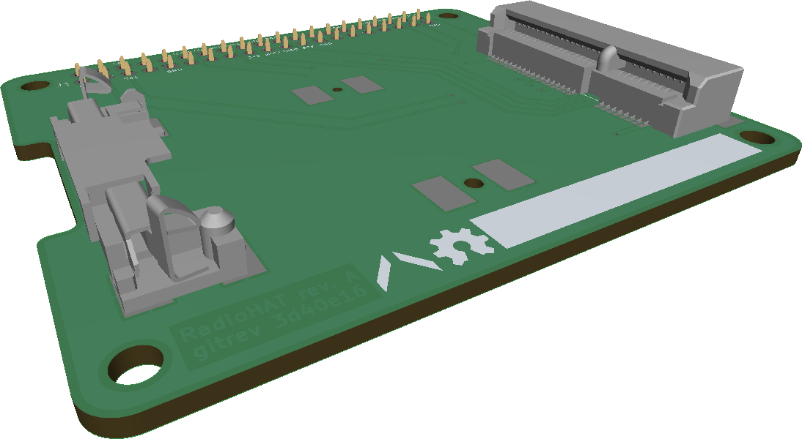
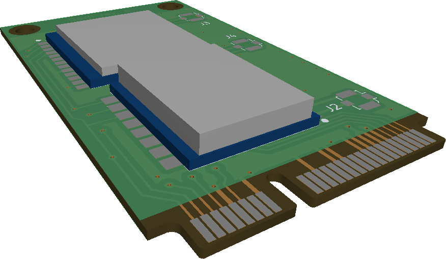
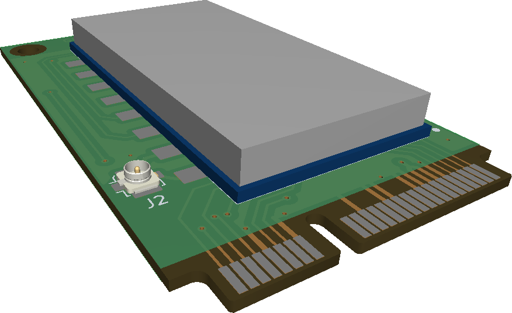

# RadioHAT
Raspberry Pi PCIe HAT for radio modules

The HAT is a simple adapter board for mini-PCIe cards (half-size or full-size). The cards themselves house various RF modules.

## RadioHAT

## Card for modules from Dorji

## Card for modules from GNice-RF

TODO:
 * split digital signals to allow multiple modules on a single card
 * add PCIe pinout table to readme
 * add RPi pinout to readme